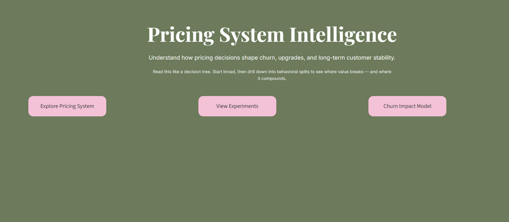
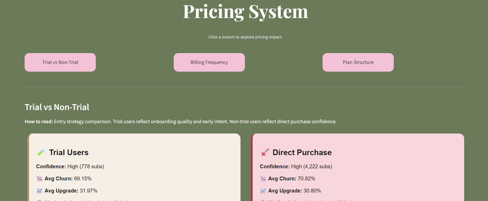
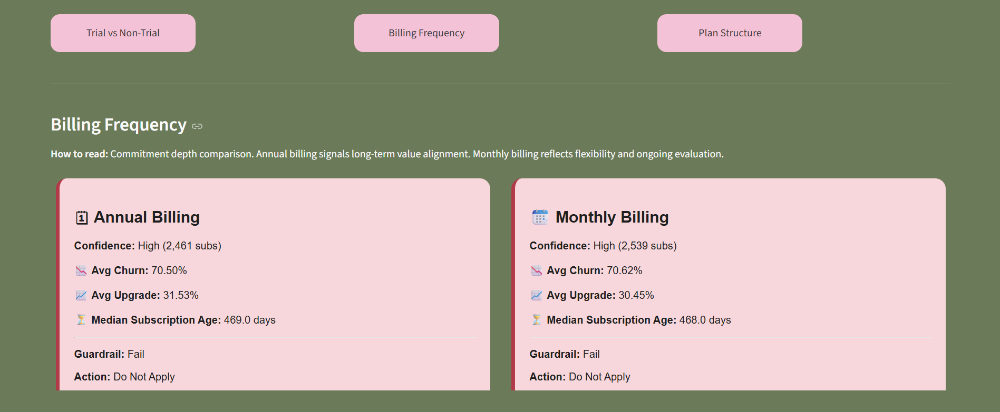
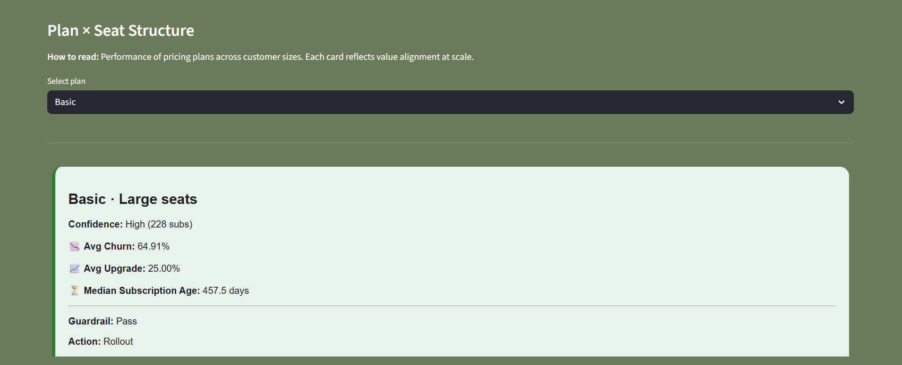
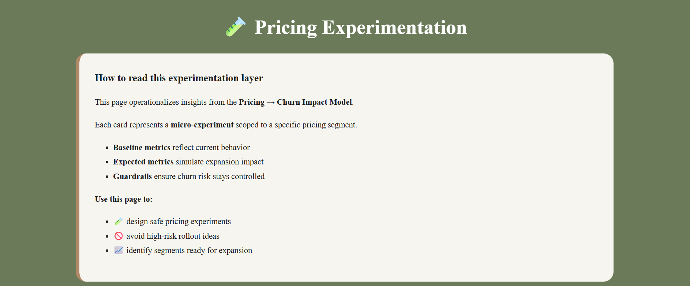
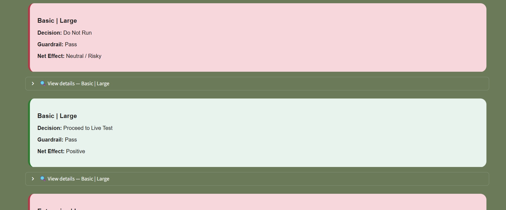
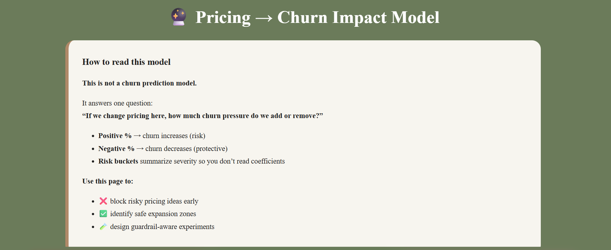
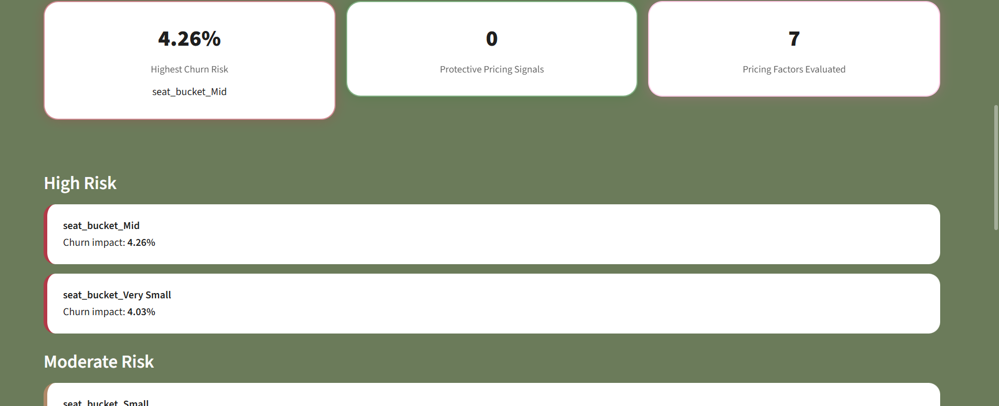

# Pricing, Experimentation & Churn Strategy System

A **decision-first analytics system** designed to help SaaS teams
make **pricing and growth decisions without violating churn guardrails**.

This is **not a dashboard of charts**.
This is a **pricing strategy engine**.

---

## 🔍 What This System Does

This project answers one core question:

> *“If we change pricing here, what churn pressure do we add or remove?”*

It combines:
- Descriptive pricing analysis
- Guardrail-aware experimentation
- Interpretable churn impact modeling

Into a **single decision workflow**.

---

## 🧱 System Architecture

### 1️⃣ Pricing System
Evaluates pricing structures across:
- Trial vs Non-Trial entry
- Monthly vs Annual billing
- Plan × Seat scaling

Each branch surfaces:
- Churn risk
- Upgrade behavior
- Subscription maturity
- Clear recommended actions

---

### 2️⃣ Experimentation Engine
Transforms insights into **micro-experiments**:
- Each experiment is scoped to a pricing segment
- Baseline vs expected impact is simulated
- Guardrails determine go / no-go decisions

Designed for **safe expansion**, not blind A/B testing.

---

### 3️⃣ Pricing → Churn Impact Model
A strategy model that:
- Quantifies **pricing-driven churn pressure**
- Outputs **percentage impact**, not predictions
- Buckets risk into interpretable categories

This model supports:
- Blocking risky ideas early
- Identifying safe expansion zones
- Designing guardrail-aware experiments

---

## 🧠 Why This Is Different

- ❌ Not a churn prediction model  
- ❌ Not a metrics dump  
- ✅ A **decision system** for pricing & growth teams  

Built to answer **“Should we do this?”**, not just **“What happened?”**

---

## 🛠️ Tech Stack

- Python
- Pandas / NumPy
- Scikit-learn (interpretable modeling)
- Streamlit (product-style dashboard)
- Modular data loaders & views

---

## 📸 Screenshots

| Pricing System | Experimentation |
|---------------|-----------------|
|  |   |  |  | |  |

| Churn Impact Model |
|-------------------|
|  |  |

---

## 🚀 Who This Is For

- SaaS pricing & growth teams
- Product analysts
- Strategy & experimentation roles
- Finance / Revenue analytics

---

## 📌 Author
**Ridhisha Tyagi**  
